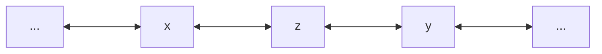

# Abstract

It is the case that the numbers we as mathematicians use constantly have no gaps in measurable distance
    between sequential elements.
Why is this the case?
In particular why is it obvious that the numbers used for (almost) all of mathematics provably have no measurable gaps.
I have made it my business to relearn analysis in more depth and I found myself coming back to this question.
There is an axiom of completeness associated with $\mathbb{R}$,
    necessarily this axiom is made obvious via any construction of $\mathbb{R}$.
Here I will investigate this central axiom and make an attempt to examine its finer details.
With this newly discovered intuition I investigate $\mathbb{C}$ to address the same question,
    with particular interest to the contrasting answer.

# Introduction
Intuition is key to every field of mathematics,
    one does more and more problems until their intuition blossoms.
If one builds their intuition upon assumptions that are not completely understood,
    this can be dangerous to later concepts.
Thus is the purpose of my investigation into $\mathbb{R}$.
The completeness axiom did not entirely make sense to me which I found interesting enough to write about.
This axioms states simply that the real numbers are complete,
    meaning there is no measurable gap between any two sequential elements of $\mathbb{R}$.

\begin{equation} \label{comp-axiom}
    (a, b \in \mathbb{R}) \land (\nexists c \in \mathbb{R} \mid a < c < b)
    \implies \forall \epsilon > 0, |a - b| < \epsilon
\end{equation}

It is particularly interesting that it is vacuously proven through both common constructions of $\mathbb{R}$.
Reading through <d-cite key="cummings"></d-cite> it becomes intuitive that the real numbers are complete.
However my intuition seemed semantically contaminated,
    building intuition atop naive trust in the author seemed irresponsible<d-footnote>
Though it does provide an interesting thought to the question of inductive learning. </d-footnote>.
Thus I stepped back once I finished my reading,
    I began to ask why the completeness axiom is obvious from a proof of construction.
The course of action from there somewhat obviously is to understand the various proofs of construction.
There exist two major construction methods Dedekind cuts and Cantor's Cauchy construction.
Digressing momentarily into the rational numbers and my point of curiosity,
    we then continue to the constructions.

# Rationals & My Quandary
When we intuit numbers in general we think of the naturals first (naturally).
These being the numbers beginning at one incrementing to infinity at a step of one.
After we have pondered the naturals for some time we can begin to understand,
    there exist natural<d-footnote>
        I can not help myself from making puns with natural numbers, apologies.</d-footnote>
    gaps between the natural numbers.
In particular, there is no numbers that exist to represent that expression $1 - 1$ or $1 - 2$.
Thus we discover both zero and the negative natural numbers<d-footnote> I am over simplifying it significantly </d-footnote>, $\mathbb{Z}$.
Once we have discovered $\mathbb{Z}$ our work begins to get rather interesting.
In discovering $\mathbb{Z}$ we have a ring closed under addition, subtraction, & multiplication;
    However, division presents a problem.
Thus we begin to create a definition of numbers which are closed under division,
    something describable in the following way.

\begin{equation} \label{rationals}
    \mathbb{Q} = \[ \frac{z}{n} \mid (\forall z \in \mathbb{Z})(\forall n \in \mathbb{N}) \]
\end{equation}

We observe from Eq. \eqref{rationals} that the rational numbers include the Integers and
    every fractional value between sequential Integers.
In the event that all numbers of a desired space are fractional $\mathbb{Q}$ presents no problem.
Once numbers such as $\pi$ and $e$ appear the problem becomes self-evident.
There does not exist a fractional form of these numbers.
Formally this concept is presented below in Eq. \eqref{rational problem}.

\begin{equation} \label{rational problem}
    (\forall a_{n},a_{n+1} \in \mathbb{Q} \mid a_{n} < a_{n+1}) (\nexists h \in \mathbb{Q} \mid a_{n} < h < a_{n+1})
    \implies (\exists z \notin \mathbb{Q})(a_{n} < z < a_{n+1})
\end{equation}

We observe that there exist numbers outside the Rational ring,
    numbers that exist measurably in the world.
Thus in an attempt to completely capture the numbers we can observe metrically we create another set of numbers.
A union of the Rationals designed above and those numbers which are not included in the rationals but can be detected.
The question now becomes how do we construct such a ring<d-footnote>
    Note I use the term "ring" loosely throughout the paper. As a proper definition is not assumed here. </d-footnote>
    of numbers?

# Cantor's Cauchy sets
Of the three constructions I present here this one makes the least sense to me.
Thus in perfect mathematics fashion I shall present it first.
The crux of Cantor's construction is the understanding of the Cauchy sequence.
Not a particular set but (at least in my mind) an attribute of a given set.

\begin{equation} \label{cauchy-seq}
    (\\{ a_n \\} \subset \mathbb{R})(\forall \epsilon > 0)(\exists N \in \mathbb{N}) \implies
    (|a_n - a_m| < \epsilon)(n,m > N)
\end{equation}

In Eq \eqref{cauchy-seq} we understand that a Cauchy sequence is one that after some element $a_n$ (assuming $n \le m$) changes very little.
That is all the elements of a Cauchy sequence after a particular element converge to the same number<d-cite key="rudin"></d-cite>.
This information is crucial to understand Cantor's construction in that his construction is built upon Cauchy sequences.
If one is to construct the real numbers,
    one is particularly interested in proving the existence of the irrational numbers with respect to $\mathbb{Q}$.
In particular this means the goal of any good construction is the proof of the *least-upper-bound*.
Cauchy sequences have a natural bounding,
    note by Eq \eqref{cauchy-seq} there exists some element $a_n$ by which $a_n + 1$ is not in the sequence.
In particular there exists a set $S$ such that all elements of $S$ are upper bounds of our Cauchy sequence.
That is all $x \in S$ exist such that $x$ is larger than all elements of our Cauchy sequence.
Assume $S$ to be ordered, thus there exists a minimum value of the sequence $S$.
The existence of this minimum value implies the existence of our *least-upper-bound* property.
Given the *least-upper-bound* property or the supremum we can begin work on finding the irrationals.
Given all Rational Cauchy sequences,
    we can conclude that we have the Cauchy sequences which approach the irrational numbers<d-cite key="richmond"></d-cite>.

$$
\begin{equation}
    (\exists (c_n) \subset \mathbb{Q})(sup(c_n) \notin \mathbb{Q})
\end{equation}
$$

Thus by including those supremums of these sequences we can provably include all irrational values.
This is of course an oversimplification, _c'est la vie_.
Thus we can conclusively prove the completeness of $\mathbb{R}$ such that we include all rational Cauchy sequences and their respective supremum.
With this construction it should be logically impossible to have gaps in the number line.
A colloquial analogy might look something like this: "if you stand in a room with limited light,
    take into account first what you can see,
    then use what you can see to infer whats between what you can see and the walls"
    <d-footnote> while naive this was a helpful thought for me </d-footnote>.

# Dedekind's cuts
Dedekind cuts,
    the explanation rooted in frustration <d-cite key="saclolo"></d-cite><d-cite key="crosby"></d-cite> due to Dedekind's struggle with the structure of a proof
    <d-footnote> A struggle I can relate to personally. </d-footnote>.
The proof begins with a simple intuition;
    if one splits a line on a single number then one is left with two rays and a number.
That is if we separate from any number $z$ all those numbers $(x_n)$
    such that $(x_n) < z$ and all those numbers $(y_n)$ such that $(y_n) > z$.
We are left with that line which is to the right of $z$ on $\mathbb{Q}$ and that line which is to the left.
It is kind of Dedekind to allow for $z$ to be placed either on the left or right.
This intuition can be thought of as the picture below.

Dedekind proves that each cut produced by no rational number must be produced by an irrational number<d-cite key="crosby"></d-cite>.
In particular we define some cut $(A_1,A_2)$ such that the sequences $A_1$ & $A_2$ represent all numbers less than and greater than $D$, respectively.
Thus Dedekind proves that there exist cuts such that $D \notin \mathbb{Q}$.
The proof starts by establishing the cut $(A_1, A_2)$ such that $D$ is some positive integer but not the square of an integer.

$$
\begin{equation} \label{define-cuts}
\begin{aligned}
    A_1 &= \{ a_1 \in \mathbb{Q} \mid (a_1^2 \le D) \lor (a_1 \le 0) \} \\
    \exists &\lambda \in \mathbb{Z} \mid \lambda^2 < D < (\lambda + 1)^2 \\
    A_2 &= \{ a_2 \in \mathbb{Q} \land a_2^2 > D \}
\end{aligned}
\end{equation}
$$

We can see this is a valid cut as $\forall a_1 \in A_1, \forall a_2 \in A_2 | a_1 < a_2$.
It can then be seen that _There exists no rational number whose square is_ $D$ thus this cut is produced by a non-rational value.

### Lemma: There exist no rational number whose square is D
Let us assume the following:

$$
\begin{equation} \label{lemma-init}
    \exists t, u \in \mathbb{Z} \mid (\frac{t}{u})^2 = D
\end{equation}
$$

Note here we can assume that $u$ is the smallest integer such that $u^2 D = t^2$.
We know this given the following.

$$
    \lambda^2 < D = (\frac{t}{u})^2 < (\lambda + 1)^2
$$

We can now find the integer $u'$.

$$
    \lambda < \frac{t}{u} \implies u' = t - \lambda u
$$

$$
    0 < u' <  u \implies 0 = \lambda u - \lambda u < t - \lambda u < (\lambda + 1)u - \lambda u = u
$$

We can also find $t' = Du - \lambda t$ by way of the equation $\lambda t < \frac{t^2}{u} = Du$.

$$
\begin{equation} \label{lemma-eq}
\begin{aligned}
    t'^2 - Du'^2
    = D^2u^2 + 2Du\lambda t + \lambda^2 t^2 - Dt^2 + 2Dt \lambda u - D \lambda^2 u^2
    = (\lambda^2 - D)(t^2 - Du^2)
\end{aligned}
\end{equation}
$$

We know that $u$ is the smallest value where Eq \eqref{lemma-init} should be true.
We have proven that another number $u'$ exists such that the property holds with Eq \eqref{lemma-eq}$^\blacksquare$.
The above proof is taken with appreciation from <d-cite key="crosby"></d-cite>.

### Theorem: Irrationals are defined by cuts that can not be defined by rationals

Thus the square of every rational number $x$ is either greater than or less than $D$.
It follows that there is no greatest rational numbers in either $A_1$ or a least rational number in $A_2$.
Let us consider the following rational number.

$$
\begin{equation} \label{theorem: y def}
    y = \frac{x(x^2 + 3D)}{3x^2 + D}
\end{equation}
$$

$$
\begin{equation} \label{theorem: y-x}
\begin{aligned} 
    y - x &= \frac{x(x^2 + 3D)}{3x^2 + D} - x * \frac{3x^2 + D}{3x^2 + D} \\
    y - x &= \frac{2x(D-x^2)}{3x^2 + D} 
\end{aligned}
\end{equation}
$$

$$
\begin{equation} \label{theorem: y2D}
\begin{aligned}
    y^2 - D &=  \frac{(x^2 - D)^3}{(3x^2 + D)^2} \\
    &= \frac{x^2(x^4 + 6Dx^2 + 9D^2) - D(9x^4 + 6Dx^2 + D^2)}{(3x^2 + D)^2}
\end{aligned}
\end{equation}
$$

If we assume $x \in A_2$ that is $x^2 > D$, we must also note that $y \in A_2$ as $y-x > 0 \implies y>x$ from Eq \eqref{theorem: y-x}.
We can show that $x$ is not the greatest values of $A_1$ by Eq \eqref{theorem: y2D} that $y^2 - D < 0$ implying $y \in A_1$.
Once we have shown that there is no greatest rational value of the sequence $A_1$ we show there is no least rational value of $A_2$.
Assume $x \in A_2$, we know that $y < x \land y > 0$ and $y^2 > D$ thus $x$ is not the smallest value of $A_2$.
Thus no rational value is the smallest value of $A_2$ showing that $(A_1, A_2)$ can not be generated by a rational value$^\blacksquare$<d-cite key="crosby"></d-cite>.

## Continuity
Dedekind has defined irrational numbers using his cuts,
    now we must define the set $\mathbb{R} = \mathbb{Q} \cup (\mathbb{R} \setminus \mathbb{Q})$.
The way he does this is by stitching together all possible cuts<d-cite key="saclolo"></d-cite> $(A_1, A_2)$,
    such that the all rational numbers not contained in $A_1$ are contained in $A_2$.
Above we prove that in the set of all cuts are contained those numbers which are not rational.
Thus we have found that all possible cuts will contain both rational and irrational values.
Now we strive to prove that by combining all possible cuts we have that set which is ordered and continues,
    thus complete.
Let us consider the two cuts $(A_1, A_2)$ and $(B_1, B_2)$ defined by the numbers $\alpha, \beta$ respectively.
When we combine these sets we can compare them in the following ways <d-cite key="saclolo"></d-cite>:
1. The two cuts are exactly identical, such that $\alpha = \beta$.
2. There exists only one number $a_1'$ such that $a_1' \in A_1 \land a_1' \notin B_1$.
In this second case, it is true that for each value $b_1 \in B_1$ that $b_1 < a_1'$.
Thus there must exist some $b_2' \in B_2$ such that $b_2' = a_1'$.
This is true given that all values of $B_1$ are less than $a_1'$;
    recall all numbers are contained one of the two sides of a cut thus the number $a_1'$ if not contained in one side of the cut must be in the other side.
Given that there exists only one $a_1' \in A_1$ such that $a_1' \notin B_1$ but all other values of $A_1$ are in $B_1$.
We deduce that $a_1' = b_2' \in B_2'$ is the smallest element of $B_2$ or the _infimum_.
That is $\alpha = \beta$ such that the generating numbers of the two cuts must be equal.
In particular we say that these cuts are *unessentially different*<d-cite key="saclolo"></d-cite>.

3. There exists at least two numbers $a_1', a_1'' \in A \land a_1', a_1'' \notin B_1$.
Recall that between any two rational numbers there is infinitely many numbers.
In particular for any two rational numbers $\gamma < \theta$ there exists $\phi$ such that $\gamma < \phi < \theta$.
Thus these two cuts are _infinitely_ different.
Such that the generating numbers are different and comparable as such $\alpha > \beta, \alpha < \beta$.

It is the case that the inverse of situation two reveals the _supremum_ property or the _least-upper-bound_ property necessary for completeness.
Revealing such a property satisfies my question.
With that information we move to the next method,
    however it is worthy of note that both <d-cite key="saclolo"></d-cite> & <d-cite key="crosby"></d-cite> go on to define in detail Dedekind's method of construction.

# Weierstrass construction
Karl Weierstrass also has a construction of a real numbers.
One that particularly presents as less of a set theoretic approach.
Weierstrass describes that we he terms an _aggregate_, see <d-cite key="bennabi"></d-cite> & <d-cite key="bolling"></d-cite>.
This aggregate is described in fashion of a combinatoric problem,
    as a kind of composition of natural numbers and some operation.
That is to describe some $x$ in terms of some $\lambda \in \Lambda$ as in the following from.
We can see that the complete sequence of all aggregate values create from $\Lambda$ is simply
    $(x_\lambda)_{\lambda \in \Lambda}$ from <d-cite key="bennabi"></d-cite>.

Weierstrass goes on to describe rationals in terms of these aggregates using $\Lambda = \mathbb{N}$.
In particular outlining a more combinatoric definition of the field of rational numbers.
Specifically with _Proposition 3.5_ in <d-cite key="bennabi"></d-cite> we can see the redesigning of the rational values.

It is the case that Weierstrass crafts an explicit construction of the real number described in
    <d-cite key="bennabi"></d-cite> & <d-cite key="bolling"></d-cite>.
In particular a construction of a different kind than both Dedekind and Cantor.
With that said my appetite was satiated with his redefining the rational values of that of his aggregate.

# Future questions
1. It is the case (most confidently) that the real numbers are a **complete**, ordered field.
Having begun my studies on the complex plane,
    it seems that complex numbers form a field which is not verifiable complete.
It would be of interest to me to find out why this is.
I assume in my studying the complex numbers this answer will be revealed.
2. Since the real numbers can be constructed in such different ways as Dedekind cuts and the Weierstrass method,
    is there a best method of construction?
In particular is it the case that one method reveals particularities that are not observed by the other?
3. Is this notion of completeness modular?
In particular,
    is it possible to formulate a proof where in one proves that a different set is equivalently complete as compared to the real numbers.
This concept seems rather possible though an exact example eludes me entirely.
